<div align="center">

<!-- Animated header -->


<br>

<a href="https://github.com/divyasri0629"></a>
<a href="https://www.linkedin.com/"></a>
<a href="mailto:YOUR-EMAIL"></a>
<a href="https://leetcode.com/"></a>

</div>

---

<h3><code>&gt; ./contributions.sh</code></h3>

<div align="center">
  
</div>

---

<h3><code>&gt; whoami</code></h3>

<div align="center">
<table>
  <tr>
    <td valign="top"></td>
    <td valign="top"></td>
  </tr>
</table>
</div>

> B.Tech Information Technology student focused on building practical software with **Flutter, Python, DSA and AI/ML**. I enjoy turning ideas into clean applications, learning by building, and improving my problem-solving skills through coding practice.

```bash
$ cat .profile
ROLE      = B.Tech IT Student / Aspiring Software Engineer
EDUCATION = Aditya Engineering College
STACK     = Python | Dart | Java | C | JavaScript | HTML | CSS | MySQL
BUILDING  = Flutter apps | DSA tools | AI/ML projects
FOCUS     = Software Engineering | Mobile Development | AI/ML
```

---

<h3><code>$ ls /tech-stack</code></h3>

<div align="center">

**Languages**  


**Frameworks / Tools**  


**Data / AI**  


</div>

---

<h3><code>$ cat /expertise</code></h3>

| Area | Level | What I work with |
| :--- | :---: | :--- |
| **DSA & Problem Solving** | Strong | Arrays, strings, sliding window, stacks, hashing and competitive programming practice |
| **Flutter Development** | Strong | Responsive mobile UI, navigation, reusable widgets and app architecture |
| **Python** | Strong | Problem solving, automation and introductory ML workflows |
| **AI / Machine Learning** | Growing | scikit-learn, NLP concepts and ML project development |
| **Frontend Development** | Strong | HTML, CSS, JavaScript and responsive UI development |
| **Databases** | Working | MySQL and application data handling |

---

<h3><code>$ ls /projects</code></h3>

<details open>
<summary><b>▶ CrackIt — Interview Preparation App</b></summary>

A Flutter-based interview preparation app bringing technical and placement practice into one place.

| Aspect | Detail |
| :--- | :--- |
| **Stack** | Flutter · Dart |
| **Features** | DSA questions · Aptitude · MCQs · HR · GD topics · Favorites |
| **Contribution** | UI, navigation, question flows and reusable Flutter components |
| **Repository** | GitHub profile repositories |

</details>

<details>
<summary><b>▶ Clarity — Time, Mind & Notes Companion</b></summary>

A productivity and learning concept combining planning, Pomodoro, notes, reflections, streaks and learning modules.

| Aspect | Detail |
| :--- | :--- |
| **Stack** | Flutter · Dart |
| **Modules** | Daily planner · Pomodoro · Notes · Mood/reflection · DSA/Aptitude learning |
| **Goal** | One focused workspace for productivity and learning |

</details>

<details>
<summary><b>▶ AI / ML Project Work</b></summary>

Exploring practical AI projects such as phishing detection, fake-news detection and resume intelligence using Python and machine-learning techniques.

| Aspect | Detail |
| :--- | :--- |
| **Stack** | Python · scikit-learn · NLP concepts |
| **Focus** | Classification · feature engineering · model evaluation |

</details>

---

<h3><code>$ cat /experience.log</code></h3>

### Frontend Developer Intern — NUNC SYSTEMS PVT LTD
**May 2025 – July 2025**

- Built responsive interfaces using **HTML, CSS, JavaScript and Bootstrap**.
- Worked on reusable UI components and responsive layouts.
- Improved practical frontend development and debugging skills.

**Skills:** `HTML` `CSS` `JavaScript` `Bootstrap` `Responsive UI`

---

<h3><code>$ cat /achievements</code></h3>

- ⭐ **HackerRank:** 5-Star in Java, C and Problem Solving
- 🏅 **AlgoUniversity Tech Fellowship:** Top 8% — Stage 1
- 📜 **Postman Student Expert** — 2026
- 📜 **MongoDB Associate Developer** — 2026
- 📜 **Google Play Store Listing Certificate** — 2026
- 📜 **Oracle AI Data Platform Essentials** — 87%
- 📜 **Red Hat OpenShift** — 2025

---

<h3><code>$ cat /education</code></h3>

**B.Tech — Information Technology**  
Aditya Engineering College · Expected 2027 · CGPA **9.09/10**

**Intermediate — MPC**  
Tirumala Junior College · **95.6%**

**10th Grade**  
Bhashyam English Medium School · **100%**

---

<h3><code>$ ./coding-profiles</code></h3>

<div align="center">
<a href="https://github.com/divyasri0629"></a>
<a href="https://www.hackerrank.com/"></a>
<a href="https://leetcode.com/"></a>
</div>

---

<h3><code>$ ./github-analytics</code></h3>

<div align="center">
  
  
</div>

<div align="center">
  
</div>

---

<h3><code>$ ./trophies</code></h3>

<div align="center">
  
</div>

---

<h3><code>$ ./activity</code></h3>

<div align="center">
  
</div>

---

<h3><code>$ cat current-focus.yaml</code></h3>

```yaml
learning:
  - Data Structures & Algorithms
  - Machine Learning with Python
  - Flutter application development

building:
  - Interview preparation tools
  - Productivity and learning apps
  - AI/ML project prototypes

exploring:
  - Generative AI
  - Software engineering best practices
  - Better GitHub portfolio automation

open_to:
  - Software Engineering internships
  - Flutter / Mobile Development roles
  - AI/ML learning opportunities
```

---

<h3><code>$ ./contribution-snake</code></h3>

<div align="center">
  <picture>
    <source media="(prefers-color-scheme: dark)" srcset="https://raw.githubusercontent.com/divyasri0629/divyasri0629/output/github-contribution-grid-snake-dark.svg" />
    <source media="(prefers-color-scheme: light)" srcset="https://raw.githubusercontent.com/divyasri0629/divyasri0629/output/github-contribution-grid-snake.svg" />
    
  </picture>
</div>

---

<h3><code>$ exit</code></h3>

<div align="center">

**Build. Learn. Solve. Repeat.**

<a href="https://github.com/divyasri0629"></a>
<a href="mailto:YOUR-EMAIL"></a>

<br><br>


</div>
